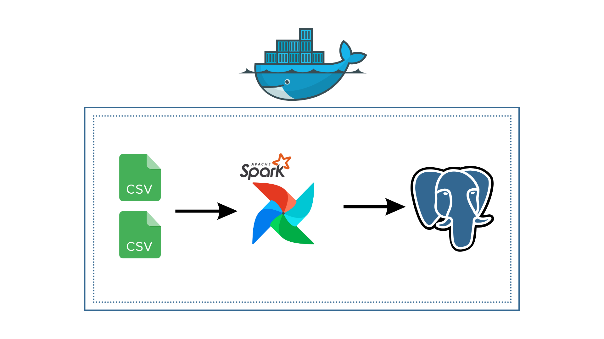

# ETL Pipeline with Spark, Airflow, and PostgreSQL

This project demonstrates an ETL pipeline using Apache Spark for data processing, Apache Airflow for workflow orchestration, and PostgreSQL for data storage. The pipeline processes transaction and behavior data, combines them, and loads the combined data into PostgreSQL.




## Tools and Technologies

- **Apache Spark**: Used for distributed data processing.
- **Apache Airflow**: Used for workflow orchestration.
- **PostgreSQL**: Used for data storage.
- **Docker**: Used for containerizing the services.

## Project Structure

- `dags/`: Contains Airflow DAG definitions.
- `scripts/`: Contains additional Python scripts for data processing.
- `data/`: Contains input data files and output processed data.
- `docker`: Docker Compose file to set up the multi-container environment.

## Getting Started

### Prerequisites

- Docker and Docker Compose installed on your machine.

### Setup

1. **Clone the repository**:
    ```sh
    git clone https://github.com/Salah-Mahmoud/Spark-Airflow-and-PostgreSQL-ETL-Pipeline
    cd spark-airflow-postgres-etl
    ```

2. **Build and start the Docker containers**:
    ```sh
    docker compose up -d --build
    ```

3. **Access the Airflow web UI**:
    Open your browser and go to `http://localhost:8080`. Use the following credentials to log in:
    - **Username**: admin
    - **Password**: admin

4. **Run the DAG**:
    - In the Airflow UI, enable the `transaction_behaviour_etl` DAG and trigger it manually.

### Data Processing

- **Transaction Data**: Processed using Spark to clean and format the data.
- **Behavior Data**: Processed using Spark to clean and format the data.
- **Combined Data**: Merged transaction and behavior data, saved as CSV, and loaded into PostgreSQL.

### Services

- **Spark Master**: Accessible at `http://localhost:9090`.
- **Spark Worker**: Works in conjunction with the Spark Master.
- **PostgreSQL**: Accessible at `localhost:5433`.
- **Airflow Webserver**: Accessible at `http://localhost:8080`.
- **PgAdmin**: Accessible at `http://localhost:5050`.

### Configuration

Ensure that the following connections are configured in Airflow:

- **PostgreSQL Connection**:
  - **Conn Id**: `postgres-conn`
  - **Conn Type**: `Postgres`
  - **Host**: `postgres`
  - **Schema**: `airflow`
  - **Login**: `airflow`
  - **Password**: `airflow`
  - **Port**: `5432`

### Scripts

- **Data Processing**:
  - `scripts/data_processing.py`: Contains functions to load transaction data, load behavior data, and combine the data.

### Docker Compose Configuration

- **Spark Master**: For managing Spark jobs.
- **Spark Worker**: For executing Spark jobs.
- **PostgreSQL**: For storing the processed data.
- **Airflow Webserver and Scheduler**: For orchestrating the workflow.
- **PgAdmin**: For managing the PostgreSQL database.

### Example DAG

The `transaction_behaviour_etl` DAG includes the following tasks:
- **Load Transaction Data**: Reads and processes transaction data.
- **Load Behavior Data**: Reads and processes behavior data.
- **Combine Data**: Combines transaction and behavior data.
- **Load to PostgreSQL**: Loads the combined data into PostgreSQL.


## Contact

If you have any questions or suggestions, please feel free to contact me at [salah.mahmoud8889@gmail.com].

